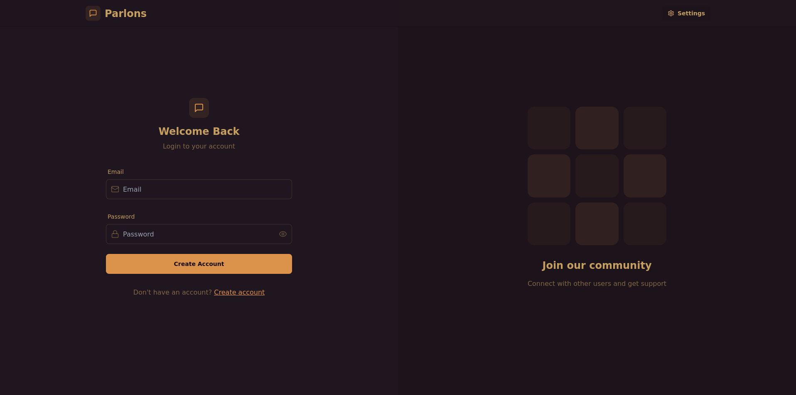
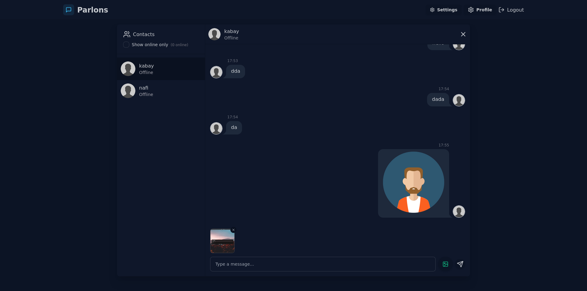
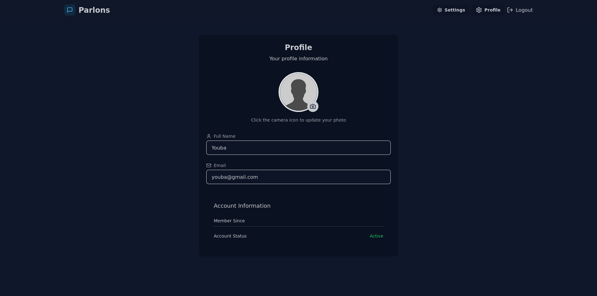

# 🗨️ Chat App – Parlons

**Parlons** is a real-time chat application built with the MERN stack (MongoDB, Express.js, React, Node.js). It offers a modern messaging experience with features like user authentication, chat rooms, and media sharing.


## 🚀 Features

- 🔐 User authentication with JWT
- 💬 Real-time messaging using Socket.IO
- 🧑‍🤝‍🧑 Group and private chat rooms
- 📎 Media file sharing (images, documents)
- 🌙 Dark and light theme support
- 📱 Responsive design for mobile and desktop

## 🛠️ Tech Stack

- **Frontend:** React, Redux, Tailwind CSS
- **Backend:** Node.js, Express.js, Socket.IO
- **Database:** MongoDB (via Mongoose)
- **Authentication:** JWT (JSON Web Tokens)
- **Real-time Communication:** Socket.IO

## 📸 Screenshots





## ⚙️ Installation

### Prerequisites

- Node.js (v14 or higher)
- MongoDB (local or cloud instance)

### Clone the Repository

```bash
git clone https://github.com/yaouba/chat-app-parlons.git
cd chat-app-parlons
```

### Backend Setup

```bash
cd backend
npm install
```

Create a `.env` file in the `backend` directory with the following content:

```env
PORT=5000
MONGO_URI=your_mongodb_connection_string
JWT_SECRET=your_jwt_secret
```

Start the backend server:

```bash
npm run dev
```

### Frontend Setup

```bash
cd ../frontend
npm install
```

Start the frontend development server:

```bash
npm start
```

The application will be accessible at `http://localhost:3000`.

## 🧪 Testing

To run tests for both frontend and backend:

### Backend Tests

```bash
cd backend
npm test
```

### Frontend Tests

```bash
cd ../frontend
npm test
```

## 📁 Project Structure

```
chat-app-parlons/
├── backend/
│   ├── controllers/
│   ├── models/
│   ├── routes/
│   ├── .env
│   └── server.js
├── frontend/
│   ├── public/
│   ├── src/
│   │   ├── components/
│   │   ├── pages/
│   │   ├── redux/
│   │   └── App.js
├── screenshots/
└── README.md
```

## 🤝 Contributing

Contributions are welcome! Please follow these steps:

1. Fork the repository
2. Create a new branch: `git checkout -b feature/your-feature-name`
3. Commit your changes: `git commit -m 'Add your feature'`
4. Push to the branch: `git push origin feature/your-feature-name`
5. Open a pull request

## 📄 License

This project is licensed under the MIT License.
